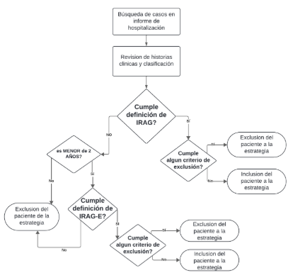

```{r}
#| echo: false
#| warning: false

source("librerias.R")
source("importacion_base_nominal.R")
source("Establecimiento.R")
source("Mapa/mapa_efectores.R")
source("Graficos/casos_semanas_epidemiologicas.R")
source("Graficos/grafico_evolucion_UTIP.R")
source("Graficos/grafico_determinaciones_edad.R")
source("Graficos/grafico_determinaciones_se.R")
source("Graficos/comorbilidades.R")
source("Graficos/vacunaVSR.R")
source("Graficos/agrupado.R")

```

## INTRODUCCIÓN

Las infecciones respiratorias agudas (IRA) representan una importante causa de morbimortalidad, especialmente en niñas y niños menores de cinco años, con mayor impacto en los menores de dos años, en adultos mayores y en personas con enfermedades preexistentes. La vigilancia integrada de virus respiratorios con potencial epidémico y pandémico, como SARS-CoV-2, Influenza, virus sincicial respiratorio (VSR) y otros, resulta esencial para caracterizar la situación epidemiológica, detectar eventos inusuales y aplicar oportunamente medidas de prevención y control. Este análisis se plantea con el objetivo de describir la epidemiología de las Infecciones Respiratorias Agudas Graves (IRAG) en la población pediátrica consultante en el Hospital `r establecimiento` de la provincia de Mendoza durante el período semana epidemiológica (SE) `r semana_min_anio_minimo` de `r anio_minimo` a SE`r semana_max_anio_minimo` de `r anio_maximo`, aportando datos que contribuyan a producir información para la toma de decisiones basadas en evidencia. Dicho establecimiento, es una institución pediátrica polivalente de alta complejidad, especializada en la atención de pacientes agudos y crónicos, y constituye el hospital de referencia de la Región de Cuyo. El mismo atiende a la patología proveniente del Gran Mendoza y a la patología pediátrica regional de otras provincias que conforman la región de Cuyo.

**Mapa 1.** Geolocalización de los efectores pertenecientes a la Red Nacional de UC-IRAG de la provincia de Mendoza.

```{r}
#| echo: false


mapa_efectores

```

Fuente: Elaboración propia. Dirección de Epidemiología, Calidad y Control de Gestión. Ministerio de Salud y Deporte de Mendoza.

## OBJETIVO GENERAL

Caracterizar a través de variables epidemiológicas, clínicas y del diagnóstico etiológico los casos de IRAG e IRAG extendida (IRAGe) en pacientes pediátricos del `r establecimiento` de la provincia de Mendoza, desde la SE `r semana_min_anio_minimo` de `r anio_minimo` a la SE`r semana_max_anio_minimo` de `r anio_maximo`.

## OBJETIVOS ESPECÍFICOS

-   Determinar la frecuencia y distribución temporal (por SE) de los casos de IRAG e IRAGe.

-   Definir la frecuencia y la distribución temporal (por SE) y por grupo etario de los agentes etiológicos priorizados (VSR, SARS CoV-2, Influenza).

-   Caracterizar la presencia de comorbilidades y el requerimiento de terapia intensiva de los casos de IRAG e IRAGe.

-   Analizar los antecedentes de vacunación materna contra VSR, en casos de IRAG e IRAGe notificados en menores de 6 meses en el SNVS 2.0.

-   Caracterizar la demanda asistencial y el impacto en la ocupación de camas de internación general pediátrica y terapia intensiva pediátrica y/o neonatal.

## DEFINICIONES DE CASO

### Infección Respiratoria Aguda Grave (IRAG)

Paciente de cualquier edad con infección respiratoria aguda con:

-   Fiebre referida o constatada \>= 38°C; y Tos; y

-   Inicio del cuadro en los 10 días precedentes; y

-   Requerimiento de internación por criterio clínico.

### Infección Respiratoria Aguda Grave (IRAG) extendida en \< 2 años

Infección respiratoria: definida por tos o dificultad respiratoria; e

-   Inicio del cuadro en los 10 días precedentes; y

-   Requerimiento de internación por criterio clínico.

En lactantes menores de 6 meses también considerar:

-   Apnea (cese temporal de la respiración por cualquier causa), o

-   Sepsis (fiebre/hipotermia y shock y gravemente enfermo sin causa aparente).

**Figura 1.** Flujograma de identificación de pacientes en la UC-IRAG, `r establecimiento`.

::: {style="text-align: center;"}

:::

Fuente: Elaboración propia. UC-IRAG `r establecimiento`.

::: criterios-pequenos
**Criterios de inclusión**

-   Pacientes de 0 a 15 años que cumplan con las definiciones de caso IRAG/IRAGe.

-   Pacientes que cumplen con las definiciones de caso antedichas e inicio de los síntomas en la comunidad dentro de los 10 días previos a la internación.

-   Estadía hospitalaria con internación mínima de 24 hs o que haya fallecido en menos de ese plazo.

**Criterios exclusión**

-   Casos invalidados por epidemiología (se excluyen a los fines del análisis).

-   Casos de IRAG/ IRAGe sin muestra de laboratorio o con muestra procesada con pruebas no moleculares al momento de contabilizar las determinaciones totales (se excluyen a los fines del análisis).

-   Pacientes internados previamente en otra institución y posteriormente derivados al establecimiento que funciona como UC por la gravedad del caso.

-   Infección respiratoria de posible origen nosocomial con fecha de inicio de síntomas 24 hs posterior al ingreso o antecedente de internación por cualquier causa dentro de los 14 días previos al nuevo ingreso por IRAG.

-   Sintomatología que pueda explicarse por procesos no infecciosos (por ejemplo, insuficiencia cardíaca aguda, tromboembolismo pulmonar).
:::

## SITUACIÓN EPIDEMIOLÓGICA

### Curva epidémica: casos de IRAG e IRAGe por SE

Desde que se inicio la Estrategia de Unidades Centinela de Infecciones Respiratorias Agudas Graves (UC-IRAG), en el `r establecimiento` en la SE `r semana_min_anio_minimo` de `r anio_minimo` hasta la SE `r semana_max_anio_minimo` de `r anio_maximo`, se han notificado un total de `r casos_totales` casos. El siguiente gráfico muestra los casos totales de IRAG (n=`r casos_IRAG`) e IRAGe (n=`r casos_IRAGe`) registrados en dicho periodo. Se observa que, en ambos años, la mayor cantidad de casos se notificaron en la SE 33 (mes de agosto). Además, el año en curso presenta un menor número de casos registrados en comparación con el mismo periodo del año anterior.

**Gráfico 1.** Casos de IRAG e IRAGe por semana epidemiológica. SE `r semana_min_anio_minimo`/`r anio_minimo` - SE `r semana_max_anio_minimo`/`r anio_maximo`. `r establecimiento` Mendoza. (N =`r casos_totales`)

```{r}
#| echo: false

casos_se

```

Fuente: elaboración propia a partir de datos extraídos del Sistema Nacional de Vigilancia - SNVS 2.0.

### Determinaciones virales positivas: virus respiratorios priorizados (Inlfuenza, SARS CoV-2 y VSR)

En el periodo analizado, se registraron `r total_detectables` determinaciones positivas. Tal como se observa en el gráfico 2, el Virus Sincicial Respiratorio (VSR) fue el agente con la mayor cantidad de resultados positivos, registrando `r casos_VSR` (`r porc_VSR`%) determinaciones positivas entre los casos de IRAG e IRAGe. Entre la SE 23 y 41 del 2024, se observa que la circulación predominante correspondió al VSR, con un pico entre las SE 28 y 31 de ese año. La circulación de Influenza se registró en segundo lugar con `r casos_influenza` determinaciones positivas (`r porc_influenza`%) y con menor magnitud . Hacia las últimas semanas del año, la circulación de Influenza y VSR disminuyó de manera progresiva, destacándose la aparición de SARS-CoV-2 con `r casos_covid` determinaciones positivas (`r porc_covid`%). Durante las primeras semanas del 2025 (hasta la SE 15), se observó una baja circulación de los tres virus respiratorios. No obstante, a partir de la SE 16, se registró un nuevo aumento de determinaciones positivas, alcanzando un segundo pico en la SE 33, nuevamente con predominio de VSR. Este comportamiento refleja el patrón estacional esperado para los virus respiratorios.

**Gráfico 2.** Determinaciones virales positivas por semana epidemiológica en casos notificados de IRAG e IRAGe. SE `r semana_min_anio_minimo`/`r anio_minimo` - SE `r semana_max_anio_minimo`/`r anio_maximo`. `r establecimiento` Mendoza. (N =`r total_detectables`)

```{r}
#| echo: false

grafico_interactivo_virus

```

Fuente: elaboración propia a partir de datos extraídos del Sistema Nacional de Vigilancia - SNVS 2.0.

### Distribución por edad de los virus respiratorios priorizados

La mayor concentración de determinaciones positivas por grupo etario se observó en el grupo de 6 a 23 meses, seguido por los menores de 6 meses. El VSR predomina de manera significativa entre las determinaciones positivas de menores de 4 años. Por otro lado, en los grupos de 5 a 14 años, hay un mayor predominio de Influenza. En todos los grupos etarios, la incidencia de SARS-CoV-2 es significativamente menor, en comparación con los otros virus respiratorios analizados dentro de la estrategia.

**Gráfico 3.** Determinaciones virales positivas por grupo etario en casos notificados de IRAG e IRAGe. SE `r semana_min_anio_minimo`/`r anio_minimo` - SE `r semana_max_anio_minimo`/`r anio_maximo`.`r establecimiento` Mendoza. (N =`r total_detectables`)

```{r}
#| echo: false


grafico_interactivo_virusedad
```

Fuente: elaboración propia a partir de datos extraídos del Sistema Nacional de Vigilancia - SNVS 2.0.

### Comorbilidades más frecuentes reportadas entre los casos de IRAG e IRAGe pediátricos

El 32,8% de las comorbilidades notificadas en la estrategia correspondieron a bronquiolitis previa y el 12,8% a prematuros. El predominio en el reporte de estas comorbilidades podría corresponderse con la mayor cantidad de determinaciones positivas para VSR identificadas, respaldando la evidencia de una predisposición de estos pacientes a desarrollar dicha patología.

**Tabla 1.** Comorbilidades notificadas en los casos de IRAG e IRAGe. SE `r semana_min_anio_minimo`/`r anio_minimo` - SE `r semana_max_anio_minimo`/`r anio_maximo`. `r establecimiento` Mendoza.

```{r}
#| echo: false

graficocomorbilidad
```

Fuente: Elaboración propia a partir de datos extraídos del Sistema Nacional de Vigilancia - SNVS 2.0.

### Requerimiento de terapia intensiva

En nuestra población pediátrica, la proporción de casos de IRAG e IRAGe que durante la internación requirieron cuidados críticos (UTIP/Neonatología) es relativamente bajo. En relación a la calidad de la notificación de esta dato, menos de un 10% de los casos (8,8% de las IRAG y 7,9% de la IRAGe notificadas) no tienen la información reportada al SNVS 2.0. De los casos con información disponible, la proporción de casos de IRAG que requirió UTI, alcanzó el `r porc_IRAG_UTI`%, mientras que entre las IRAGe, el porcentaje fue superior, de `r porc_IRAGe_UTI`% (grupo etario de 0 a 23 meses).

**Gráfico 4.** Requerimiento de UTIP en casos notificados de IRAG e IRAGe. SE `r semana_min_anio_minimo`/`r anio_minimo` - SE `r semana_max_anio_minimo`/`r anio_maximo`. `r establecimiento` Mendoza. (N=`r casos_totales`)

```{r}
#| echo: false

grafico_UTIP_2
```

Fuente: Elaboración propia a partir de datos extraídos del Sistema Nacional de Vigilancia - SNVS 2.0.

### Antecedentes de vacunación materna contra VSR en menores de 6 meses

En el período de estudio, se notificaron un total de `r totales` casos de IRAG e IRAGe en menores de 6 meses. El `r porc_vac_no`% (N=`r vac_no`) no presentaba antecedentes de vacunación materna contra el Virus Sincicial Respiratorio- VSR , mientras que el `r porc_vac_si` % (N=`r vac_si`) sí contaban con antecedentes de vacunación materna. Estos hallazgos nos permiten inferir una buena calidad en cuanto al reporte del dato de vacunación en el sistema nacional de vigilancia en salud (SNVS 2.0) en el marco de esta estrategia, lo que permite estimar la cobertura de vacunación materna y contribuir, en otro tipo de análisis, con la hipótesis del impacto que esta vacuna tendría en la prevención de las infecciones por VSR en este grupo etario.

**Gráfico 5.** Antecedentes de vacunación materna contra VSR en casos de IRAG e IRAGe menores de 6 meses. SE `r semana_min_anio_minimo`/`r anio_minimo` - SE `r semana_max_anio_minimo`/`r anio_maximo`.`r establecimiento` Mendoza. (N=`r totales`)

```{r}
#| echo: false


Grafico_vacuna
```

Fuente: Elaboración propia a partir de datos extraídos del Sistema Nacional de Vigilancia - SNVS 2.0.

### Impacto en la ocupación de camas de internación pediátrica

Del análisis de la notificación agrupada numérica durante el período considerado, se desprende que la proporción de internaciones relacionadas con la estrategia centinela (casos de IRAG e IRAGe) representan el `r porc_IRAG_totales_agrupado`% del total de internaciones del hospital. Este dato demuestra no sólo la relevancia de esta estrategia en dicho establecimiento, sino que aporta una aproximación objetiva acerca del impacto que las infecciones respiratorias agudas graves tienen sobre la ocupación de camas hospitalarias, teniendo en cuenta que los casos de IRAG e IRAGe corresponden a una fracción de los casos que requieren internación por causa respiratoria, ya que no todas las IRA con requerimiento de internación se notifican en esta estrategia, acorde con las definiciones vigentes.

**Gráfico 6.** Cantidad y porcentaje de ingreso a internación por IRAG e IRAGe y otras causas. SE `r semana_min_anio_minimo`/`r anio_minimo` - SE `r semana_max_anio_minimo`/`r anio_maximo`. `r establecimiento` Mendoza. (N= 12964)

```{r}
#| echo: false

Graficoagrupado

```

Fuente: base de datos de la notificación agrupada numérica semanal de la UC-IRAG `r establecimiento` Mendoza.
